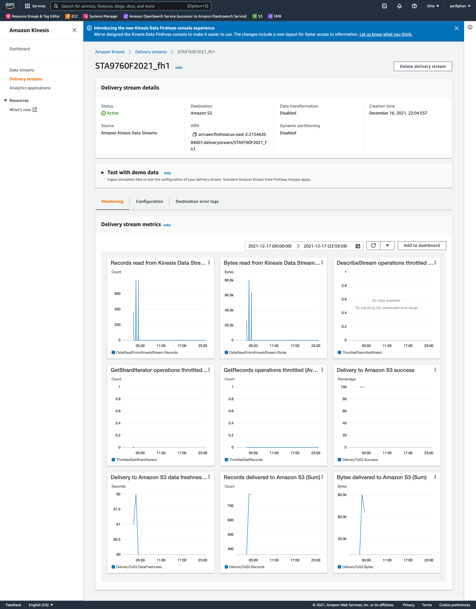

# Streaming Finance Data with AWS Lambda

In this project, we will demonstrate a streaming pipeline to stream near real time stock price data using yfinance module. 

The pipeline is broken down as follows:

1. Data Transformer

    Stock price data is ingested by yfinance module based on a AWS lambda function running a python script. The program collects four data points - stock ticker, timestamp, high price for ticker, low price for ticket at five minute intervals. Output of this step leads to pushing of ingested data to a AWS Kinesis stream.

2. Data Collector
    
    Kinesis stream collects the data from the lambda function and stores data files in designated AWS S3 buckets. Output of this step leads to S3 buckets full of data ready to be analyzed.

3. Data Analyzer

    AWS Glue Crawler is configured to convert the data in the S3 bucket to database schema and tables. AWS Athena is then used to query the data using SQL and export resulting tables in .csv format. This particular query gets the highest hourly stock “high” per company. Output of this step creates csv tables that can be inputs to jupyter notebook files for further analysis
    
4. Data Visualization

    Jupyter notebook is used to perform further analysis on the queried data from Athena. Data visualizations are designed to explore the data; the visualizations are as follows:
    
	a. Interactive Stock Trend Line Plot - Line plot to show stock price changes trend over time of day - 	single select panel widget buttons to allow for interactive stock ticker selection.

	b. Interactive Stock Trend Line Plot Cumulative - Line plot to show stock price changes trend for all stock tickers over time of day - multi select panel widget buttons to allow adding/removing certain stock tickers from the chart.

	c. Hourly Stock Heatmap - Heatmap to show stock prices distribution for all stock tickers over time of day - multi select panel widget buttons to allow adding/removing certain stock tickers from the 	chart.
	
	Finally, for easier access to this visualization module, a public web application is deployed that contains all of the three charts in this module and allows the user to access these interative charts via a web browser without needing to interact with the python backend. Here is the link to the web application:  https://stockpriceviz.herokuapp.com/   [https://stockpriceviz.herokuapp.com/](https://stockpriceviz.herokuapp.com/)

## Running the program

1. Create a AWS Kinesis stream that has an AWS S3 bucket destination
2. Write a AWS Lambda function with python code in the "data_transformer.py" file (make sure to provide Kinesis permissions to the Lambda function)
3. Configure a AWS Glue crawler on the S3 directory to create databae schema and tables
4. Run query using the "query.sql" file on AWS Athena to get the highest hourly stock “high” per company.
5. Load the "Analysis.ipynb" file in Jupyter notebook to perform further analysis and visualization

## AWS Kinesis Configuration

-- Aarif M Jahan -- Dec 17, 2021

